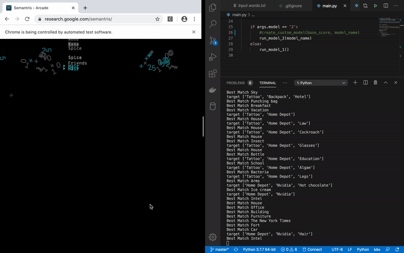

# Semantris Breaker (Arcade Mode)

Some time ago google created beautiful word association game of [semantris](https://research.google.com/semantris/). Based on their description it uses ML for assessing semantic similarities between words, based on which scores are assigned.

Game is easy to play. In the Arcade mode you get your target word then you type similar word to it and if it is close enough you get your score.

While time goes on more and more words are added to the queue and if you reach top of the screen you lose.

While it is fun to play its hard to top 5 000 point, not to mention 10 000 +

So we tried to break it using ML and automation

Result:


# How to run it ?

```bash
pip3 install requirements.txt

python -m spacy download en_core_web_lg

# Depending on the model 1 or 2. Using Model 2 will first try to generate model
# Which might take some time. 
python3 main.py -m 1

```

Once game starts you need to manually click start arcade button.
Afterwards it will start playing on its own

# Process

There are two steps for solving the problem 

1) Figure out IO of the game and how information can be read and write 
2) Create proper model which will predict similarty to the target words

## Game Mechanics
As the game in written using [PIXI.JS](https://github.com/pixijs/pixi.js) there are no DOM elements which can be directly manipulated for our purpose. So at the beginning it seemed almost impossible to get the data out of it and submit anything to it.

After reviewing the code base it turned out we could utilze some built in objects for this purpose

```javascript
this.game.currentGame

this.game.currentGame.targetLines
this.game.currentGame.userSubmit(a,b)
this.game.currentGame.state
this.game.currentGame.points
this.game.currentGame.bannedPrefixes
```

## Building Model

### Model 1 
To test our idea, first we used [Datamuse](https://www.datamuse.com/api/) API for making simple calls. This method proved to be succesful and we managed to hit 13 000 on average. But as words got more complicated (Including book and actors names)  issues started to arise

### Model 2
For The next iteration we used [Spacy](https://spacy.io/) for creating our own model. We utilized thing that at the beginning of the game all words that are supposed to be used is loaded.

Using this method we managed to increase our scores significantly. Even managing to break the game at 16250 points



# Acknowledgments
props to : [Valdio](https://github.com/valdio)